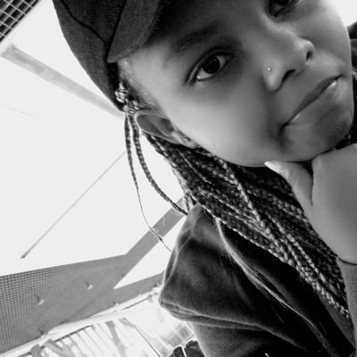

# RW-Android-Bootcamp-2020

  

  
  
#### NAME
Carol Musyoka

#### DISCORD USERNAME
Carol Musyoka

#### BASIC LOCATION
Nairobi, Kenya

#### PROGRAMMING EXPERIENCE
Less than 1 year

#### GOALS
I would like to advance in the mobide development field in a few years to come. I hope that I will gain lots of knowledge from the bootcamp and grow as a developer. Since I am an introvert i tend to keep to myslef alot. But I am pretty good at writing and I have a technical blog on dev.to . I love open source too. My last project was testing at Fenix which was a bit challenging because i am not thaaaat good yet. So basically, this bootcamp will be of lots of help and I really hope I will be back to open source contribution with lots of knowledge.
